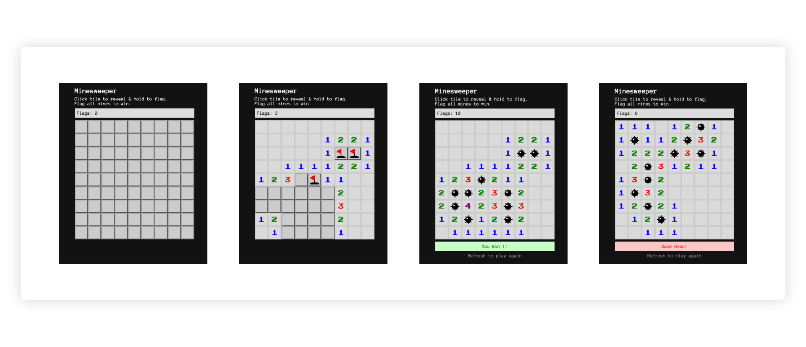

# Minesweeper

Minesweeper is a single-player puzzle video game. The objective of the game is to clear a rectangular board containing hidden "mines" or bombs without detonating any of them, with help from clues about the number of neighboring mines in each field.<br />
[More...](https://en.wikipedia.org/wiki/Minesweeper_(video_game))

## To Play

Visit: <br/>
<https://sarthakdandotiya.github.io/Minesweeper/>

## To Run Locally

- Clone the repository
- Open terminal
- Navigate to the root of the project folder
- Type in terminal,<br />**```yarn start```** or **```npm start```**

## Sample


